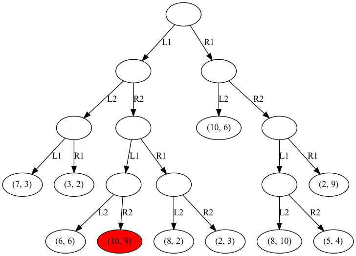

# Game Theory Mini Project 1

This repository contains the code for game theory mini project 1. This mini project generates a binary tree with levels based on the user input for the number of stages to generate.

A **"divide and conquer"** algorithm is then used to find the **reasonable Nash Equilibrium** of the graph. Finally, the binary tree is shown on a png file output with the reasonable Nash Equilibrium node highlighted in **red**. 

## Binary tree generation
The binary tree is generated by taking an input from the user stating the number of stages to generate the tree on. 

The number of child nodes per stage is randomly generated using the random Python module, with a minimum of 1 node and a maximum of 2^n nodes, where n is the current stage being generated. Generating a minimum of 1 child node ensures that binary tree will always reach the number of stages stated by the user. 

Each parent node is guaranteed to have at least 2 child nodes, each representing the two options available for the current player.

This project also assumes that player 1 will make his move first, and each player will be granted a move after the previous player until m turns. 

## Algorithm approach
The approach of the "divide and conquer" algorithm starts from the root node of the binary tree. It iteratively checks if the current node is a leaf node. As each parent node is guaranteed to have at 2 children, this algorithm will then compare the 2 leaf nodes of the parent node and return the node with a better payoff for the current player. 

For example, 2 leaf nodes have payoffs (8,1) and (3,4) respectively. Assuming that player 1 is making a choice this turn, the leaf node with payoff (8,1) will be returned. 

If both leaf nodes have the same payoffs for the player choosing, a random node is returned with equal probability as the player does not have any incentive to choose either node over the other. 

## Graph visualization



The graph visual is created using graphviz package and it is output in a png file. 

At each stage, each node edge is labelled with L1, R1, L2 or R2. The letter represents the possible action for the player, namely L (left) or R (right). These are just generic actions representing the two possible actions. The number represents the turn made by the player, with 1 representing the action for player 1 and 2 representing the action for player 2.

The payoffs are represented in tuples at the leaf nodes, with the first number representing the payoff for player 1 and the second number representing the payoff for player 2. 

Finally, the reasonable Nash Equilibrium is represented by the red node in the binary tree.

## Steps to run project
This project assumes that you have Python3 installed in your device and that you are already in the project directory.

### 1. Start by creating a python virtual environment
```
python3 -m venv venv
```

### 2. Activate the python virtual environment
**On Mac:**
```
source venv/bin/activate
```

**On Windows:**
```
source venv\Scripts\activate
```

### 3. Install all dependencies required
```
pip install -r requirements.txt
```

### 4. Run the project at game_theory_mini_project.py

## Declaration of use of AI

ChatGPT 4.o was used to help with providing hints on how to use the graphviz module to generate the visualization of the graph. Everything else from the algorithm to the doc strings are written manually without any help from AI tools. 